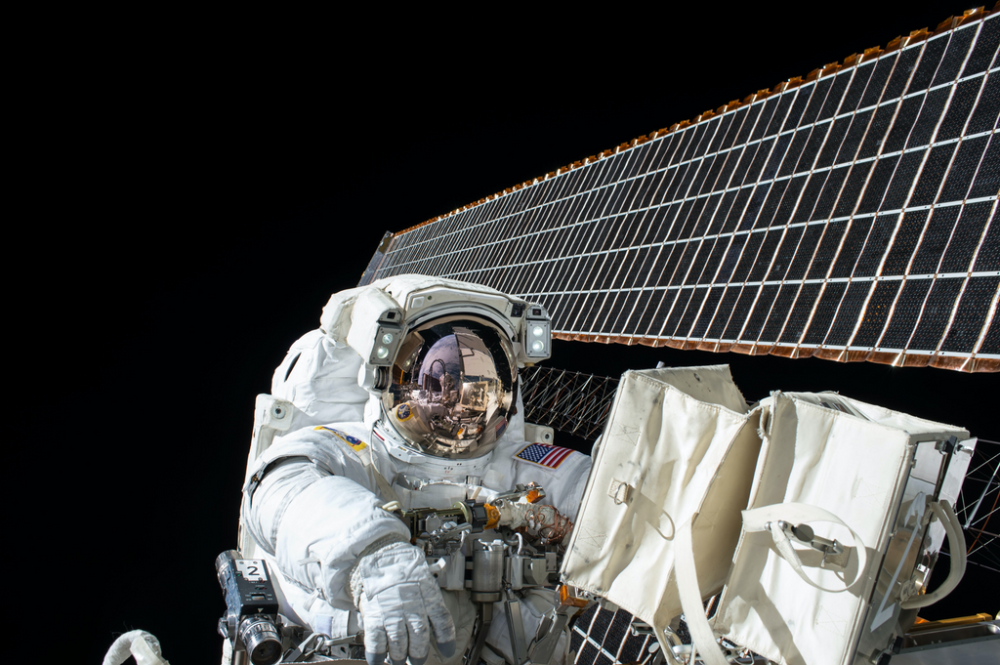

# `Image`

Image processing library.

This library support encode/decode these formats:

| Format    | Input                                     | Output                                  |
| --------- | ----------------------------------------- | --------------------------------------- |
| RawPixels | RGBA 8 bits pixels                        |                                         |
| JPEG      | Baseline and progressive                  | Baseline JPEG                           |
| PNG       | All supported color types                 | Same as decoding                        |
| BMP       | ✅                                        | Rgb8, Rgba8, Gray8, GrayA8              |
| ICO       | ✅                                        | ✅                                      |
| TIFF      | Baseline(no fax support) + LZW + PackBits | Rgb8, Rgba8, Gray8                      |
| WebP      | No                                        | ✅                                      |
| AVIF      | No                                        | ✅                                      |
| HEIC      | ✅ (macOS & Windows)                      | ✅ (macOS & Windows)                    |
| PNM       | PBM, PGM, PPM, standard PAM               | ✅                                      |
| DDS       | DXT1, DXT3, DXT5                          | No                                      |
| TGA       | ✅                                        | Rgb8, Rgba8, Bgr8, Bgra8, Gray8, GrayA8 |
| OpenEXR   | Rgb32F, Rgba32F (no dwa compression)      | Rgb32F, Rgba32F (no dwa compression)    |
| farbfeld  | ✅                                        | ✅                                      |
| SVG       | ✅                                        |                                         |

See [index.d.ts](./packages/binding/index.d.ts) for API reference.


## HEIC support (macOS & Windows)

HEIC decode **and** encode work on **macOS and Windows**. Both delegate to the operating system's
HEVC codec — **ImageIO** on macOS, the **Windows Imaging Component (WIC)** on Windows — which holds
the HEVC patent license. This means the package **ships no HEVC/HEIC codec** and incurs no codec
licensing. On other platforms, HEIC decode and `.heic()` / `.heicSync()` reject with a clear error.

> **Windows codec:** WIC's HEVC support comes from the OS *HEVC Video Extensions* / *HEIF Image
> Extension* Store packages. They are absent on stock Windows Server / CI runners; on such a host
> HEIC decode and encode reject with a clear "codec not installed" error.

- **Decode:** reads `.heic` / `.heif` (HEVC-in-HEIF, e.g. iPhone photos). EXIF orientation is honored
  just like JPEG. Wide-gamut input is color-matched to **sRGB** (v1 normalizes everything to sRGB and
  carries no ICC profile).
  - macOS: 8-bit sources decode to RGBA8; 10-bit sources decode to RGBA16 (precision preserved).
  - Windows: WIC normalizes all HEIF to 8-bit, so decode always yields RGBA8 (including 10-bit input).
- **Encode:** `new Transformer(input).heic({ quality, bitDepth })` / `.heicSync(...)`. `quality` is
  `0-100` (default `80`).
  - macOS (ImageIO): no truly-lossless mode; compression is clamped to `0.9`, so `quality` `90`–`100`
    all map to that ceiling (a ~1-3/255 residual, visually indistinguishable from `1.0`). `bitDepth`
    is `8`/`10` (default follows the source — 16-bit images write 10-bit HEVC Main10).
  - Windows (WIC): `quality` maps linearly to `0.0`–`1.0` with **no clamp** (`100` encodes fine). The
    WIC HEVC encoder emits **8-bit only** and **opaque only** — alpha is flattened, and `bitDepth: 10`
    is **rejected** with a clear error rather than silently downgraded.
- **Out of scope (v1):** Apple/ISO HDR **gain-map** reconstruction. The base image is decoded at full
  bit depth, but the auxiliary gain map (the iPhone "HDR look") is not composited.

```js
import { Transformer } from '@napi-rs/image'

// decode HEIC -> JPEG (macOS & Windows)
const jpeg = await new Transformer(heicBuffer).jpeg(80)

// encode -> HEIC (macOS & Windows)
const heic = await new Transformer(pngBuffer).heic({ quality: 80 })
```

## Performance

System info

```
OS: macOS 12.3.1 21E258 arm64
Host: MacBookPro18,2
Kernel: 21.4.0
Shell: zsh 5.8
CPU: Apple M1 Max
GPU: Apple M1 Max
Memory: 9539MiB / 65536MiB
```

```
node bench/bench.mjs

@napi-rs/image 202 ops/s
sharp 169 ops/s
In webp suite, fastest is @napi-rs/image
@napi-rs/image 26 ops/s
sharp 24 ops/s
In avif suite, fastest is @napi-rs/image
```

```
UV_THREADPOOL_SIZE=10 node bench/bench.mjs

@napi-rs/image 431 ops/s
sharp 238 ops/s
In webp suite, fastest is @napi-rs/image
@napi-rs/image 36 ops/s
sharp 32 ops/s
In avif suite, fastest is @napi-rs/image
```

## `@napi-rs/image`

See [Full documentation for `@napi-rs/image`](./packages/binding/README.md)

### Example

You can clone this repo and run the following command to taste the example below:

- `yarn install`
- `node example.mjs`

| Optimization                                                                                            | Raw                                          | Raw Size | Optimized Size |
| ------------------------------------------------------------------------------------------------------- | -------------------------------------------- | -------- | -------------- |
| `losslessCompressPng()` <br/>**Lossless**                                                               |  | `1.2M`   | `876K`         |
| `pngQuantize({ maxQuality: 75 })` <br/>**Lossy**                                                        |  | `1.2M`   | `244K`         |
| `compressJpeg()` <br/>**Lossless**                                                                      |  | `192K`   | `184K`         |
| `compressJpeg(75)` <br/>**Lossy**                                                                       |  | `192K`   | `104K`         |
| `new Transformer(PNG).webpLossless()`<br/>**Lossless**                                                  |  | `1.2M`   | `676K`         |
| `new Transformer(PNG).webp(75)`<br/>**Lossy**                                                           |  | `1.2M`   | `84K`          |
| `Transformer(PNG).avif({ quality: 100 })`<br/>**Lossless**                                              |  | `1.2M`   | `584K`         |
| `new Transformer(PNG).avif({ quality: 75, chromaSubsampling: ChromaSubsampling.Yuv420 })`<br/>**Lossy** |  | `1.2M`   | `112K`         |

```js
import { readFileSync, writeFileSync } from 'fs'

import {
  losslessCompressPng,
  compressJpeg,
  pngQuantize,
  Transformer,
  ResizeFilterType,
  ChromaSubsampling,
} from '@napi-rs/image'
import chalk from 'chalk'

const PNG = readFileSync('./un-optimized.png')
const JPEG = readFileSync('./un-optimized.jpg')
// https://github.com/ianare/exif-samples/blob/master/jpg/orientation/portrait_5.jpg
const WITH_EXIF = readFileSync('./with-exif.jpg')
const SVG = readFileSync('./input-debian.svg')

writeFileSync('optimized-lossless.png', await losslessCompressPng(PNG))

console.info(chalk.green('Lossless compression png done'))

writeFileSync(
  'optimized-lossy.png',
  await pngQuantize(PNG, {
    maxQuality: 75,
  }),
)

console.info(chalk.green('Lossy compression png done'))

writeFileSync('optimized-lossless.jpg', await compressJpeg(readFileSync('./un-optimized.jpg')))

console.info(chalk.green('Lossless compression jpeg done'))

writeFileSync('optimized-lossy.jpg', await compressJpeg(readFileSync('./un-optimized.jpg'), { quality: 75 }))

console.info(chalk.green('Lossy compression jpeg done'))

writeFileSync('optimized-lossless.webp', await new Transformer(PNG).webpLossless())

console.info(chalk.green('Lossless encoding webp from PNG done'))

writeFileSync('optimized-lossy-png.webp', await new Transformer(PNG).webp(75))

console.info(chalk.green('Encoding webp from PNG done'))

writeFileSync('optimized-lossless-png.avif', await new Transformer(PNG).avif({ quality: 100 }))

console.info(chalk.green('Lossless encoding avif from PNG done'))

writeFileSync(
  'optimized-lossy-png.avif',
  await new Transformer(PNG).avif({ quality: 75, chromaSubsampling: ChromaSubsampling.Yuv420 }),
)

console.info(chalk.green('Lossy encoding avif from PNG done'))

writeFileSync(
  'output-exif.webp',
  await new Transformer(WITH_EXIF)
    .rotate()
    .resize(450 / 2, null, ResizeFilterType.Lanczos3)
    .webp(75),
)

console.info(chalk.green('Encoding webp from JPEG with EXIF done'))

writeFileSync('output-overlay-png.png', await new Transformer(PNG).overlay(PNG, 200, 200).png())

console.info(chalk.green('Overlay an image done'))

writeFileSync('output-debian.jpeg', await Transformer.fromSvg(SVG, 'rgba(238, 235, 230, .9)').jpeg())

console.info(chalk.green('Encoding jpeg from SVG done'))
```
