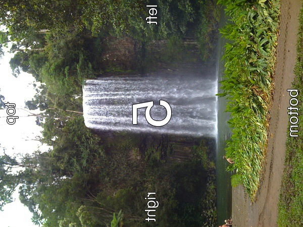
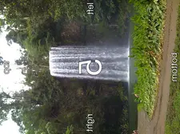
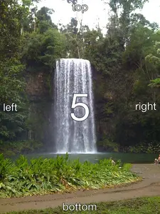

# `@napi-rs/image`

Transform and optimize images library.

See [Examples](../../example.mjs) for usage.

[](https://packagephobia.com/result?p=@napi-rs/image)
[](https://npmcharts.com/compare/@napi-rs/image?minimal=true)

## Transformer:

This library support encode/decode these formats:

| Format    | Input                                     | Output                                  |
| --------- | ----------------------------------------- | --------------------------------------- |
| RawPixels | RGBA 8 bits pixels                        |                                         |
| JPEG      | Baseline and progressive                  | Baseline JPEG                           |
| PNG       | All supported color types                 | Same as decoding                        |
| BMP       | ✅                                        | Rgb8, Rgba8, Gray8, GrayA8              |
| ICO       | ✅                                        | ✅                                      |
| TIFF      | Baseline(no fax support) + LZW + PackBits | Rgb8, Rgba8, Gray8                      |
| WebP      | ✅                                        | ✅                                      |
| AVIF      | ✅                                        | ✅                                      |
| PNM       | PBM, PGM, PPM, standard PAM               | ✅                                      |
| DDS       | DXT1, DXT3, DXT5                          | No                                      |
| TGA       | ✅                                        | Rgb8, Rgba8, Bgr8, Bgra8, Gray8, GrayA8 |
| OpenEXR   | Rgb32F, Rgba32F (no dwa compression)      | Rgb32F, Rgba32F (no dwa compression)    |
| farbfeld  | ✅                                        | ✅                                      |

See [index.d.ts](./index.d.ts) for API reference.

### New from Constructor

```ts
import { Transformer } from '@napi-rs/image'

const transformer = new Transformer(input)
```

### New from RGBA RawPixels

```ts
import { Transformer } from '@napi-rs/image'
import { decode } from 'blurhash'

// Uint8ClampedArray
const pixels = decode('LEHV6nWB2yk8pyo0adR*.7kCMdnj', 32, 32)
const transformer = Transformer.fromRgbaPixels(pixels, 32, 32)
```

### Metadata

```ts
metadata(withExif?: boolean | undefined | null, signal?: AbortSignal | undefined | null): Promise<Metadata>

export interface Metadata {
  width: number
  height: number
  exif?: Record<string, string> | undefined | null
  orientation?: number | undefined | null
  format: string
  colorType: JsColorType
}

export const enum JsColorType {
  /** Pixel is 8-bit luminance */
  L8 = 0,
  /** Pixel is 8-bit luminance with an alpha channel */
  La8 = 1,
  /** Pixel contains 8-bit R, G and B channels */
  Rgb8 = 2,
  /** Pixel is 8-bit RGB with an alpha channel */
  Rgba8 = 3,
  /** Pixel is 16-bit luminance */
  L16 = 4,
  /** Pixel is 16-bit luminance with an alpha channel */
  La16 = 5,
  /** Pixel is 16-bit RGB */
  Rgb16 = 6,
  /** Pixel is 16-bit RGBA */
  Rgba16 = 7,
  /** Pixel is 32-bit float RGB */
  Rgb32F = 8,
  /** Pixel is 32-bit float RGBA */
  Rgba32F = 9
}
```

**Example**:

```ts
import { promises as fs } from 'fs'

import { Transformer } from '@napi-rs/image'

const WITH_EXIF_JPG = await fs.readFile('with-exif.jpg')

const decoder = new Transformer(WITH_EXIF_JPG)
const metadata = await decoder.metadata(true)
```

The metadata will be

```js
{
  colorType: 2,
  exif: {
    Orientation: 'Unknown (5)',
    'Resolution Unit': 'in',
    'This image has an Exif SubIFD': '90',
    'X Resolution': '72 pixels per in',
    'Y Resolution': '72 pixels per in',
  },
  format: 'jpeg',
  height: 450,
  orientation: 5,
  width: 600,
}
```

### Transform Image format

```ts
import { promises as fs } from 'fs'

import { Transformer } from '@napi-rs/image'

const PNG = await fs.readFile('./un-optimized.png')

const webp = await new Transformer(PNG).webp()

await fs.writeFile('optimized.webp)
```

#### webp

> The quality factor `quality_factor` ranges from 0 to 100 and controls the loss and quality during compression.
>
> The value 0 corresponds to low quality and small output sizes, whereas 100 is the highest quality and largest output size.
>
> https://developers.google.com/speed/webp/docs/api#simple_encoding_api
>
> Default is 90

```ts
webp(qualityFactor: number, signal?: AbortSignal | undefined | null): Promise<Buffer>
webpSync(qualityFactor: number): Buffer
/// Encode lossless webp image
webpLossless(signal?: AbortSignal | undefined | null): Promise<Buffer>
webpLosslessSync(): Buffer
```

#### AVIF

**Config**:

```ts
export interface AvifConfig {
  /** 0-100 scale 100 is lossless */
  quality?: number | undefined | null
  /** 0-100 scale */
  alphaQuality?: number | undefined | null
  /** rav1e preset 1 (slow) 10 (fast but crappy), default is 4 */
  speed?: number | undefined | null
  /** How many threads should be used (0 = match core count) */
  threads?: number | undefined | null
  /** set to '4:2:0' to use chroma subsampling, default '4:4:4' */
  chromaSubsampling?: ChromaSubsampling | undefined | null
}

/**
 * https://en.wikipedia.org/wiki/Chroma_subsampling#Types_of_sampling_and_subsampling
 * https://developer.mozilla.org/en-US/docs/Web/Media/Formats/Video_concepts
 */
export const enum ChromaSubsampling {
  /**
   * Each of the three Y'CbCr components has the same sample rate, thus there is no chroma subsampling. This scheme is sometimes used in high-end film scanners and cinematic post-production.
   * Note that "4:4:4" may instead be wrongly referring to R'G'B' color space, which implicitly also does not have any chroma subsampling (except in JPEG R'G'B' can be subsampled).
   * Formats such as HDCAM SR can record 4:4:4 R'G'B' over dual-link HD-SDI.
   */
  Yuv444 = 0,
  /**
   * The two chroma components are sampled at half the horizontal sample rate of luma: the horizontal chroma resolution is halved. This reduces the bandwidth of an uncompressed video signal by one-third.
   * Many high-end digital video formats and interfaces use this scheme:
   * - [AVC-Intra 100](https://en.wikipedia.org/wiki/AVC-Intra)
   * - [Digital Betacam](https://en.wikipedia.org/wiki/Betacam#Digital_Betacam)
   * - [Betacam SX](https://en.wikipedia.org/wiki/Betacam#Betacam_SX)
   * - [DVCPRO50](https://en.wikipedia.org/wiki/DV#DVCPRO) and [DVCPRO HD](https://en.wikipedia.org/wiki/DV#DVCPRO_HD)
   * - [Digital-S](https://en.wikipedia.org/wiki/Digital-S)
   * - [CCIR 601](https://en.wikipedia.org/wiki/Rec._601) / [Serial Digital Interface](https://en.wikipedia.org/wiki/Serial_digital_interface) / [D1](https://en.wikipedia.org/wiki/D-1_(Sony))
   * - [ProRes (HQ, 422, LT, and Proxy)](https://en.wikipedia.org/wiki/Apple_ProRes)
   * - [XDCAM HD422](https://en.wikipedia.org/wiki/XDCAM)
   * - [Canon MXF HD422](https://en.wikipedia.org/wiki/Canon_XF-300)
   */
  Yuv422 = 1,
  /**
   * n 4:2:0, the horizontal sampling is doubled compared to 4:1:1,
   * but as the **Cb** and **Cr** channels are only sampled on each alternate line in this scheme, the vertical resolution is halved.
   * The data rate is thus the same.
   * This fits reasonably well with the PAL color encoding system, since this has only half the vertical chrominance resolution of [NTSC](https://en.wikipedia.org/wiki/NTSC).
   * It would also fit extremely well with the [SECAM](https://en.wikipedia.org/wiki/SECAM) color encoding system,
   * since like that format, 4:2:0 only stores and transmits one color channel per line (the other channel being recovered from the previous line).
   * However, little equipment has actually been produced that outputs a SECAM analogue video signal.
   * In general, SECAM territories either have to use a PAL-capable display or a [transcoder](https://en.wikipedia.org/wiki/Transcoding) to convert the PAL signal to SECAM for display.
   */
  Yuv420 = 2,
  /**
   * What if the chroma subsampling model is 4:0:0?
   * That says to use every pixel of luma data, but that each row has 0 chroma samples applied to it. The resulting image, then, is comprised solely of the luminance data—a greyscale image.
   */
  Yuv400 = 3,
}
```

```ts
avif(options?: AvifConfig | undefined | null, signal?: AbortSignal | undefined | null): Promise<Buffer>
avifSync(options?: AvifConfig | undefined | null): Buffer
```

#### PNG

**PngEncodeOptions**:

```ts
export interface PngEncodeOptions {
  /** Default is `CompressionType::Default` */
  compressionType?: CompressionType | undefined | null
  /** Default is `FilterType::NoFilter` */
  filterType?: FilterType | undefined | null
}
export const enum CompressionType {
  /** Default compression level */
  Default = 0,
  /** Fast, minimal compression */
  Fast = 1,
  /** High compression level */
  Best = 2,
  /** Huffman coding compression */
  Huffman = 3,
  /** Run-length encoding compression */
  Rle = 4,
}
export const enum FilterType {
  /**
   * No processing done, best used for low bit depth greyscale or data with a
   * low color count
   */
  NoFilter = 0,
  /** Filters based on previous pixel in the same scanline */
  Sub = 1,
  /** Filters based on the scanline above */
  Up = 2,
  /** Filters based on the average of left and right neighbor pixels */
  Avg = 3,
  /** Algorithm that takes into account the left, upper left, and above pixels */
  Paeth = 4,
  /**
   * Uses a heuristic to select one of the preceding filters for each
   * scanline rather than one filter for the entire image
   */
  Adaptive = 5,
}
```

```ts
png(options?: PngEncodeOptions | undefined | null, signal?: AbortSignal | undefined | null): Promise<Buffer>
pngSync(options?: PngEncodeOptions | undefined | null): Buffer
```

#### JPEG

```ts
/** default `quality` is 90 */
jpeg(quality?: number | undefined | null, signal?: AbortSignal | undefined | null): Promise<Buffer>
/** default `quality` is 90 */
jpegSync(quality?: number | undefined | null): Buffer
```

#### BMP

```ts
bmp(signal?: AbortSignal | undefined | null): Promise<Buffer>
bmpSync(): Buffer
```

#### ICO

```ts
ico(signal?: AbortSignal | undefined | null): Promise<Buffer>
icoSync(): Buffer
```

#### TIFF

```ts
tiff(signal?: AbortSignal | undefined | null): Promise<Buffer>
tiffSync(): Buffer
```

#### PNM

```ts
pnm(signal?: AbortSignal | undefined | null): Promise<Buffer>
pnmSync(): Buffer
```

#### TGA

```ts
tga(signal?: AbortSignal | undefined | null): Promise<Buffer>
tgaSync(): Buffer
```

#### Farbfeld

```ts
farbfeld(signal?: AbortSignal | undefined | null): Promise<Buffer>
farbfeldSync(): Buffer
```

### Manipulate Image

#### `rotate`

> Rotate the image with exif orientation, if the input image contains no exif information, this API will have no effect.

```ts
/**
 * Rotate with exif orientation
 * If the orientation param is not null,
 * the new orientation value will override the exif orientation value
 */
rotate(): this
```

**Example**:

This image has orientation value `5` in exif:



Without rotate:

```ts
import { promises as fs } from 'fs'

import { Transformer } from '@napi-rs/image'

const WITH_EXIF_JPG = await fs.readFile('with-exif.jpg')

const imageOutputWithoutRotateWebp = await new Transformer(WITH_EXIF).resize(450 / 2).webp(75)

writeFileSync('output-exif.no-rotate.image.webp', imageOutputWithoutRotateWebp)
```



With rotate:

```ts
import { promises as fs } from 'fs'

import { Transformer } from '@napi-rs/image'

const WITH_EXIF_JPG = await fs.readFile('with-exif.jpg')

const imageOutputWebp = await new Transformer(WITH_EXIF)
  .rotate()
  .resize(450 / 2)
  .webp(75)

console.timeEnd('@napi-rs/image webp')

writeFileSync('output-exif.image.webp', imageOutputWebp)
```



#### `grayscale`

```ts
/**
 * Return a grayscale version of this image.
 * Returns `Luma` images in most cases. However, for `f32` images,
 * this will return a greyscale `Rgb/Rgba` image instead.
 */
grayscale(): this
```

#### `invert`

> Invert the colors of this image.

```ts
invert(): this
```

#### `resize`

```ts
/**
 * Resize this image using the specified filter algorithm.
 * The image is scaled to the maximum possible size that fits
 * within the bounds specified by `width` and `height`.
 */
resize(width: number, height?: number | undefined | null, filterType?: ResizeFilterType | undefined | null): this

export const enum ResizeFilterType {
  /** Nearest Neighbor */
  Nearest = 0,
  /** Linear Filter */
  Triangle = 1,
  /** Cubic Filter */
  CatmullRom = 2,
  /** Gaussian Filter */
  Gaussian = 3,
  /** Lanczos with window 3 */
  Lanczos3 = 4
}
```

#### `overlay`

```ts
/**
 * Overlay an image at a given coordinate (x, y)
 */
overlay(onTop: Buffer, x: number, y: number): this
```

```ts
import { writeFileSync } from 'fs'

import { Transformer } from '@napi-rs/image'

const imageOutputPng = await new Transformer(PNG).overlay(PNG, 200, 200).png()

writeFileSync('output-overlay-png.png', imageOutputPng)
```

**ResizeFilterType**:

To test the different sampling filters on a real example, you can find two
examples called
[`scaledown`](https://github.com/image-rs/image/tree/master/examples/scaledown)
and
[`scaleup`](https://github.com/image-rs/image/tree/master/examples/scaleup)
in the `examples` directory of the crate source code.

Here is a 3.58 MiB
[test image](https://github.com/image-rs/image/blob/master/examples/scaledown/test.jpg)
that has been scaled down to 300x225 px:

<!-- NOTE: To test new test images locally, replace the GitHub path with `../../../docs/` -->
<div style="display: flex; flex-wrap: wrap; align-items: flex-start;">
  <div style="margin: 0 8px 8px 0;">
    <br>
    Nearest Neighbor
  </div>
  <div style="margin: 0 8px 8px 0;">
    <br>
    Linear: Triangle
  </div>
  <div style="margin: 0 8px 8px 0;">
    <br>
    Cubic: Catmull-Rom
  </div>
  <div style="margin: 0 8px 8px 0;">
    <br>
    Gaussian
  </div>
  <div style="margin: 0 8px 8px 0;">
    <br>
    Lanczos with window 3
  </div>
</div>

**Speed**

Time required to create each of the examples above, tested on an Intel
i7-4770 CPU with Rust 1.37 in release mode:

<table style="width: auto;">
  <tr>
    <th>Nearest</th>
    <td>31 ms</td>
  </tr>
  <tr>
    <th>Triangle</th>
    <td>414 ms</td>
  </tr>
  <tr>
    <th>CatmullRom</th>
    <td>817 ms</td>
  </tr>
  <tr>
    <th>Gaussian</th>
    <td>1180 ms</td>
  </tr>
  <tr>
    <th>Lanczos3</th>
    <td>1170 ms</td>
  </tr>
</table>

#### `blur`

> Performs a Gaussian blur on this image. <br/>
> sigma` is a measure of how much to blur by.

```ts
blur(sigma: number): this
```

#### `unsharpen`

> Performs an unsharpen mask on this image. <br/> `sigma` is the amount to blur the image by. <br/> `threshold` is a control of how much to sharpen.
>
> See <https://en.wikipedia.org/wiki/Unsharp_masking#Digital_unsharp_masking>

```ts
unsharpen(sigma: number, threshold: number): this
```

#### `filter3x3`

Filters this image with the specified 3x3 kernel. Error will thrown if the kernel length is not `9`.

```ts
filter3x3(kernel: Array<number>): this
```

#### `adjustContrast`

> Adjust the contrast of this image.<br/> `contrast` is the amount to adjust the contrast by.<br/>
> Negative values decrease the contrast and positive values increase the contrast.

```ts
adjustContrast(contrast: number): this
```

#### `brighten`

> Brighten the pixels of this image.<br/> `value` is the amount to brighten each pixel by. <br/>
> Negative values decrease the brightness and positive values increase it.

```ts
brighten(brightness: number): this
```

#### `huerotate`

> Hue rotate the supplied image.<br/> `value` is the degrees to rotate each pixel by.
> 0 and 360 do nothing, the rest rotates by the given degree value.
> just like the css webkit filter hue-rotate(180)

```ts
huerotate(hue: number): this
```

## Optimize PNG

### Lossless compression

Lossless optimize PNG powered by [oxipng](https://github.com/shssoichiro/oxipng).

**PNGLosslessOptions**

```ts
export interface PNGLosslessOptions {
  /**
   * Attempt to fix errors when decoding the input file rather than returning an Err.
   * Default: `false`
   */
  fixErrors?: boolean | undefined | null
  /**
   * Write to output even if there was no improvement in compression.
   * Default: `false`
   */
  force?: boolean | undefined | null
  /** Which filters to try on the file (0-5) */
  filter?: Array<number> | undefined | null
  /**
   * Whether to attempt bit depth reduction
   * Default: `true`
   */
  bitDepthReduction?: boolean | undefined | null
  /**
   * Whether to attempt color type reduction
   * Default: `true`
   */
  colorTypeReduction?: boolean | undefined | null
  /**
   * Whether to attempt palette reduction
   * Default: `true`
   */
  paletteReduction?: boolean | undefined | null
  /**
   * Whether to attempt grayscale reduction
   * Default: `true`
   */
  grayscaleReduction?: boolean | undefined | null
  /**
   * Whether to perform IDAT recoding
   * If any type of reduction is performed, IDAT recoding will be performed regardless of this setting
   * Default: `true`
   */
  idatRecoding?: boolean | undefined | null
  /** Whether to remove ***All non-critical headers*** on PNG */
  strip?: boolean | undefined | null
  /** Whether to use heuristics to pick the best filter and compression */
  useHeuristics?: boolean | undefined | null
}
```

```ts
export function losslessCompressPng(
  input: Buffer,
  options?: PNGLosslessOptions | undefined | null,
  signal?: AbortSignal | undefined | null,
): Promise<Buffer>
export function losslessCompressPngSync(input: Buffer, options?: PNGLosslessOptions | undefined | null): Buffer
```

### Lossy compression

Powered by [pngquant](https://github.com/ImageOptim/libimagequant), converts RGBA images to palette-based 8-bit indexed images, _including_ alpha component.

**PngQuantOptions**:

```ts
export interface PngQuantOptions {
  /** default is 70 */
  minQuality?: number | undefined | null
  /** default is 99 */
  maxQuality?: number | undefined | null
  /**
   * 1- 10
   * Faster speeds generate images of lower quality, but may be useful for real-time generation of images.
   * default: 5
   */
  speed?: number | undefined | null
  /**
   * Number of least significant bits to ignore.
   * Useful for generating palettes for VGA, 15-bit textures, or other retro platforms.
   */
  posterization?: number | undefined | null
}
```

```ts
export function pngQuantize(
  input: Buffer,
  options?: PngQuantOptions | undefined | null,
  signal?: AbortSignal | undefined | null,
): Promise<Buffer>
export function pngQuantizeSync(input: Buffer, options?: PngQuantOptions | undefined | null): Buffer
```

## Optimize JPEG

Lossy and Lossless JPEG compression powered by [mozjpeg](https://github.com/mozilla/mozjpeg).

**JpegCompressOptions**:

```ts
export interface JpegCompressOptions {
  /** Output quality, default is 100 (lossless) */
  quality?: number | undefined | null
  /**
   * If true, it will use MozJPEG’s scan optimization. Makes progressive image files smaller.
   * Default is `true`
   */
  optimizeScans?: boolean | undefined | null
}
```

```ts
export function compressJpeg(
  input: Buffer,
  options?: JpegCompressOptions | undefined | null,
  signal?: AbortSignal | undefined | null,
): Promise<Buffer>
export function compressJpegSync(input: Buffer, options?: JpegCompressOptions | undefined | null): Buffer
```

## Credits

See [Credits](./credits.md)
