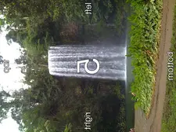
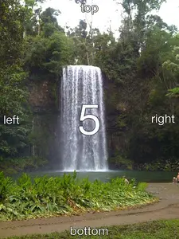

# `@napi-rs/image`

import { ResizeImageTable } from '../../components/resize-image-table'

Transform and optimize images library.

See [Examples](https://github.com/Brooooooklyn/Image/blob/main/example.mjs) for usage.

[](https://packagephobia.com/result?p=@napi-rs/image)
[](https://npmcharts.com/compare/@napi-rs/image?minimal=true)

## Transformer:

This library support encode/decode these formats:

| Format    | Input                                     | Output                                  |
| --------- | ----------------------------------------- | --------------------------------------- |
| RawPixels | RGBA 8 bits pixels                        |                                         |
| JPEG      | Baseline and progressive                  | Baseline JPEG                           |
| PNG       | All supported color types                 | Same as decoding                        |
| BMP       | ✅                                        | Rgb8, Rgba8, Gray8, GrayA8              |
| ICO       | ✅                                        | ✅                                      |
| TIFF      | Baseline(no fax support) + LZW + PackBits | Rgb8, Rgba8, Gray8                      |
| WebP      | No                                        | ✅                                      |
| AVIF      | No                                        | ✅                                      |
| PNM       | PBM, PGM, PPM, standard PAM               | ✅                                      |
| DDS       | DXT1, DXT3, DXT5                          | No                                      |
| TGA       | ✅                                        | Rgb8, Rgba8, Bgr8, Bgra8, Gray8, GrayA8 |
| OpenEXR   | Rgb32F, Rgba32F (no dwa compression)      | Rgb32F, Rgba32F (no dwa compression)    |
| farbfeld  | ✅                                        | ✅                                      |

See [index.d.ts](https://github.com/Brooooooklyn/Image/blob/main/packages/binding/index.d.ts) for API reference.

### New from Constructor

```ts
import { Transformer } from '@napi-rs/image'

const transformer = new Transformer(input)
```

### New from RGBA RawPixels

```ts
import { Transformer } from '@napi-rs/image'
import { decode } from 'blurhash'

// Uint8ClampedArray
const pixels = decode('LEHV6nWB2yk8pyo0adR*.7kCMdnj', 32, 32)
const transformer = Transformer.fromRgbaPixels(pixels, 32, 32)
```
### Metadata

```ts
metadata(withExif?: boolean | undefined | null, signal?: AbortSignal | undefined | null): Promise<Metadata>

export interface Metadata {
  width: number
  height: number
  exif?: Record<string, string> | undefined | null
  orientation?: number | undefined | null
  format: string
  colorType: JsColorType
}

export const enum JsColorType {
  /** Pixel is 8-bit luminance */
  L8 = 0,
  /** Pixel is 8-bit luminance with an alpha channel */
  La8 = 1,
  /** Pixel contains 8-bit R, G and B channels */
  Rgb8 = 2,
  /** Pixel is 8-bit RGB with an alpha channel */
  Rgba8 = 3,
  /** Pixel is 16-bit luminance */
  L16 = 4,
  /** Pixel is 16-bit luminance with an alpha channel */
  La16 = 5,
  /** Pixel is 16-bit RGB */
  Rgb16 = 6,
  /** Pixel is 16-bit RGBA */
  Rgba16 = 7,
  /** Pixel is 32-bit float RGB */
  Rgb32F = 8,
  /** Pixel is 32-bit float RGBA */
  Rgba32F = 9
}
```

**Example**:

```ts
import { promises as fs } from 'fs'

import { Transformer } from '@napi-rs/image'

const WITH_EXIF_JPG = await fs.readFile('with-exif.jpg')

const decoder = new Transformer(WITH_EXIF_JPG)
const metadata = await decoder.metadata(true)
```

The metadata will be

```js
{
  colorType: 2,
  exif: {
    Orientation: 'Unknown (5)',
    'Resolution Unit': 'in',
    'This image has an Exif SubIFD': '90',
    'X Resolution': '72 pixels per in',
    'Y Resolution': '72 pixels per in',
  },
  format: 'jpeg',
  height: 450,
  orientation: 5,
  width: 600,
}
```

### Transform Image format

```ts
import { promises as fs } from 'fs'

import { Transformer } from '@napi-rs/image'

const PNG = await fs.readFile('./un-optimized.png')

const webp = await new Transformer(PNG).webp()

await fs.writeFile('optimized.webp)
```

#### webp

> The quality factor `quality_factor` ranges from 0 to 100 and controls the loss and quality during compression. <br/>
> The value 0 corresponds to low quality and small output sizes, whereas 100 is the highest quality and largest output size. <br/>
> https://developers.google.com/speed/webp/docs/api#simple_encoding_api <br/>
> Default is 90

```ts
webp(qualityFactor: number, signal?: AbortSignal | undefined | null): Promise<Buffer>
webpSync(qualityFactor: number): Buffer
/// Encode lossless webp image
webpLossless(signal?: AbortSignal | undefined | null): Promise<Buffer>
webpLosslessSync(): Buffer
```

#### AVIF

**Config**:

```ts
export interface AvifConfig {
  /** 0-100 scale 100 is lossless */
  quality?: number | undefined | null
  /** 0-100 scale */
  alphaQuality?: number | undefined | null
  /** rav1e preset 1 (slow) 10 (fast but crappy), default is 4 */
  speed?: number | undefined | null
  /** How many threads should be used (0 = match core count) */
  threads?: number | undefined | null
  /** set to '4:2:0' to use chroma subsampling, default '4:4:4' */
  chromaSubsampling?: ChromaSubsampling | undefined | null
}

/**
 * https://en.wikipedia.org/wiki/Chroma_subsampling#Types_of_sampling_and_subsampling
 * https://developer.mozilla.org/en-US/docs/Web/Media/Formats/Video_concepts
 */
export const enum ChromaSubsampling {
  /**
   * Each of the three Y'CbCr components has the same sample rate, thus there is no chroma subsampling. This scheme is sometimes used in high-end film scanners and cinematic post-production.
   * Note that "4:4:4" may instead be wrongly referring to R'G'B' color space, which implicitly also does not have any chroma subsampling (except in JPEG R'G'B' can be subsampled).
   * Formats such as HDCAM SR can record 4:4:4 R'G'B' over dual-link HD-SDI.
   */
  Yuv444 = 0,
  /**
   * The two chroma components are sampled at half the horizontal sample rate of luma: the horizontal chroma resolution is halved. This reduces the bandwidth of an uncompressed video signal by one-third.
   * Many high-end digital video formats and interfaces use this scheme:
   * - [AVC-Intra 100](https://en.wikipedia.org/wiki/AVC-Intra)
   * - [Digital Betacam](https://en.wikipedia.org/wiki/Betacam#Digital_Betacam)
   * - [Betacam SX](https://en.wikipedia.org/wiki/Betacam#Betacam_SX)
   * - [DVCPRO50](https://en.wikipedia.org/wiki/DV#DVCPRO) and [DVCPRO HD](https://en.wikipedia.org/wiki/DV#DVCPRO_HD)
   * - [Digital-S](https://en.wikipedia.org/wiki/Digital-S)
   * - [CCIR 601](https://en.wikipedia.org/wiki/Rec._601) / [Serial Digital Interface](https://en.wikipedia.org/wiki/Serial_digital_interface) / [D1](https://en.wikipedia.org/wiki/D-1_(Sony))
   * - [ProRes (HQ, 422, LT, and Proxy)](https://en.wikipedia.org/wiki/Apple_ProRes)
   * - [XDCAM HD422](https://en.wikipedia.org/wiki/XDCAM)
   * - [Canon MXF HD422](https://en.wikipedia.org/wiki/Canon_XF-300)
   */
  Yuv422 = 1,
  /**
   * n 4:2:0, the horizontal sampling is doubled compared to 4:1:1,
   * but as the **Cb** and **Cr** channels are only sampled on each alternate line in this scheme, the vertical resolution is halved.
   * The data rate is thus the same.
   * This fits reasonably well with the PAL color encoding system, since this has only half the vertical chrominance resolution of [NTSC](https://en.wikipedia.org/wiki/NTSC).
   * It would also fit extremely well with the [SECAM](https://en.wikipedia.org/wiki/SECAM) color encoding system,
   * since like that format, 4:2:0 only stores and transmits one color channel per line (the other channel being recovered from the previous line).
   * However, little equipment has actually been produced that outputs a SECAM analogue video signal.
   * In general, SECAM territories either have to use a PAL-capable display or a [transcoder](https://en.wikipedia.org/wiki/Transcoding) to convert the PAL signal to SECAM for display.
   */
  Yuv420 = 2,
  /**
   * What if the chroma subsampling model is 4:0:0?
   * That says to use every pixel of luma data, but that each row has 0 chroma samples applied to it. The resulting image, then, is comprised solely of the luminance data—a greyscale image.
   */
  Yuv400 = 3,
}
```

```ts
avif(options?: AvifConfig | undefined | null, signal?: AbortSignal | undefined | null): Promise<Buffer>
avifSync(options?: AvifConfig | undefined | null): Buffer
```

#### PNG

**PngEncodeOptions**:

```ts
export interface PngEncodeOptions {
  /** Default is `CompressionType::Default` */
  compressionType?: CompressionType | undefined | null
  /** Default is `FilterType::NoFilter` */
  filterType?: FilterType | undefined | null
}
export const enum CompressionType {
  /** Default compression level */
  Default = 0,
  /** Fast, minimal compression */
  Fast = 1,
  /** High compression level */
  Best = 2,
  /** Huffman coding compression */
  Huffman = 3,
  /** Run-length encoding compression */
  Rle = 4,
}
export const enum FilterType {
  /**
   * No processing done, best used for low bit depth greyscale or data with a
   * low color count
   */
  NoFilter = 0,
  /** Filters based on previous pixel in the same scanline */
  Sub = 1,
  /** Filters based on the scanline above */
  Up = 2,
  /** Filters based on the average of left and right neighbor pixels */
  Avg = 3,
  /** Algorithm that takes into account the left, upper left, and above pixels */
  Paeth = 4,
  /**
   * Uses a heuristic to select one of the preceding filters for each
   * scanline rather than one filter for the entire image
   */
  Adaptive = 5,
}
```

```ts
png(options?: PngEncodeOptions | undefined | null, signal?: AbortSignal | undefined | null): Promise<Buffer>
pngSync(options?: PngEncodeOptions | undefined | null): Buffer
```

#### JPEG

```ts
/** default `quality` is 90 */
jpeg(quality?: number | undefined | null, signal?: AbortSignal | undefined | null): Promise<Buffer>
/** default `quality` is 90 */
jpegSync(quality?: number | undefined | null): Buffer
```

#### BMP

```ts
bmp(signal?: AbortSignal | undefined | null): Promise<Buffer>
bmpSync(): Buffer
```

#### ICO

```ts
ico(signal?: AbortSignal | undefined | null): Promise<Buffer>
icoSync(): Buffer
```

#### TIFF

```ts
tiff(signal?: AbortSignal | undefined | null): Promise<Buffer>
tiffSync(): Buffer
```

#### PNM

```ts
pnm(signal?: AbortSignal | undefined | null): Promise<Buffer>
pnmSync(): Buffer
```

#### TGA

```ts
tga(signal?: AbortSignal | undefined | null): Promise<Buffer>
tgaSync(): Buffer
```

#### Farbfeld

```ts
farbfeld(signal?: AbortSignal | undefined | null): Promise<Buffer>
farbfeldSync(): Buffer
```

### Manipulate Image

#### `rotate`

> Rotate the image with exif orientation, if the input image contains no exif information, this API will have no effect.

```ts
/**
 * Rotate with exif orientation
 * If the orientation param is not null,
 * the new orientation value will override the exif orientation value
 */
rotate(): this
```

**Example**:

This image has orientation value `5` in exif:


Without rotate:

```ts
import { promises as fs } from 'fs'

import { Transformer } from '@napi-rs/image'

const WITH_EXIF_JPG = await fs.readFile('with-exif.jpg')

const imageOutputWithoutRotateWebp = await new Transformer(WITH_EXIF).resize(450 / 2).webp(75)

writeFileSync('output-exif.no-rotate.image.webp', imageOutputWithoutRotateWebp)
```



With rotate:

```ts
import { promises as fs } from 'fs'

import { Transformer } from '@napi-rs/image'

const WITH_EXIF_JPG = await fs.readFile('with-exif.jpg')

const imageOutputWebp = await new Transformer(WITH_EXIF)
  .rotate()
  .resize(450 / 2)
  .webp(75)

console.timeEnd('@napi-rs/image webp')

writeFileSync('output-exif.image.webp', imageOutputWebp)
```



#### `grayscale`

```ts
/**
 * Return a grayscale version of this image.
 * Returns `Luma` images in most cases. However, for `f32` images,
 * this will return a greyscale `Rgb/Rgba` image instead.
 */
grayscale(): this
```

#### `invert`

> Invert the colors of this image.

```ts
invert(): this
```

#### `resize`

```ts
/**
 * Resize this image using the specified filter algorithm.
 * The image is scaled to the maximum possible size that fits
 * within the bounds specified by `width` and `height`.
 */
resize(width: number, height?: number | undefined | null, filterType?: ResizeFilterType | undefined | null): this

export const enum ResizeFilterType {
  /** Nearest Neighbor */
  Nearest = 0,
  /** Linear Filter */
  Triangle = 1,
  /** Cubic Filter */
  CatmullRom = 2,
  /** Gaussian Filter */
  Gaussian = 3,
  /** Lanczos with window 3 */
  Lanczos3 = 4
}
```

**ResizeFilterType**:

To test the different sampling filters on a real example, you can find two
examples called
[`scaledown`](https://github.com/image-rs/image/tree/master/examples/scaledown)
and
[`scaleup`](https://github.com/image-rs/image/tree/master/examples/scaleup)
in the `examples` directory of the crate source code.

Here is a 3.58 MiB
[test image](https://github.com/image-rs/image/blob/master/examples/scaledown/test.jpg)
that has been scaled down to 300x225 px:

<ResizeImageTable />

**Speed**

Time required to create each of the examples above, tested on an Intel
i7-4770 CPU with Rust 1.37 in release mode:

<br/>

| Filter Type    | Time Cost |
| -------------- | --------- |
| **Nearest**    | 31 ms     |
| **Triangle**   | 414ms     |
| **CatmullRom** | 817ms     |
| **Gaussian**   | 1180 ms   |
| **Lanczos3**   | 1170 ms   |

